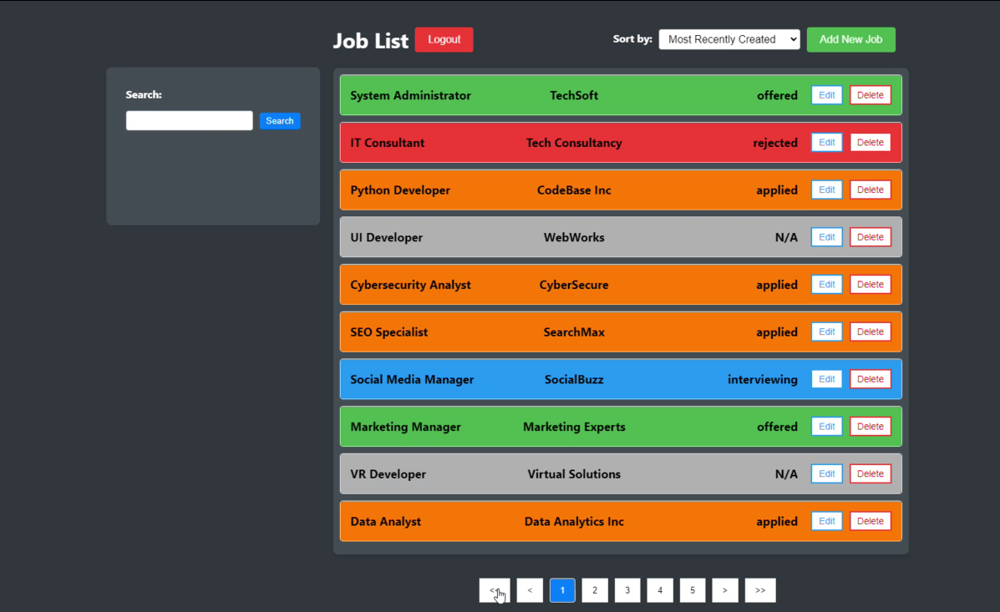

<a id="readme-top"></a>

[![Contributors][contributors-shield]][contributors-url]
[![Forks][forks-shield]][forks-url]
[![Stargazers][stars-shield]][stars-url]
[![Issues][issues-shield]][issues-url]
[![MIT License][license-shield]][license-url]

<br />
<div align="center">
  <a href="https://github.com/YiSamYan/Job-Tracker-App">
    
  </a>


<a href="http://dh4d781ylkrf.cloudfront.net/login">Frontend hosted on S3 and Backend on EC2</a>

<h3 align="center">Job Tracker App</h3>

  <p align="center">
    A full-stack job tracking application built with React (frontend) and Django (backend). This application helps users manage and track their job applications.
  </p>
</div>

<!-- TABLE OF CONTENTS -->
<details>
  <summary>Table of Contents</summary>
  <ol>
    <li>
      <a href="#about-the-project">About The Project</a>
      <ul>
        <li><a href="#built-with">Built With</a></li>
      </ul>
    </li>
    <li>
      <a href="#getting-started">Getting Started</a>
      <ul>
        <li><a href="#prerequisites">Prerequisites</a></li>
        <li><a href="#installation">Installation</a></li>
      </ul>
    </li>
    <li><a href="#usage">Usage</a></li>
    <li><a href="#features">Features</a></li>
    <li><a href="#roadmap">Roadmap</a></li>
    <li><a href="#contact">Contact</a></li>
  </ol>
</details>

## About The Project

The Job Tracker App is a comprehensive, full-stack application designed to help users efficiently manage and track their job applications. Built with a React frontend and a Django backend, the app simplifies the process of organizing and monitoring job applications by providing an intuitive interface and essential tools for creating, updating, deleting, and organizing job listings.

While the application originally included a web scraping feature to automatically fetch job details from platforms, but this feature does not work for some sites due to restrictions and blocks on scraping requests by those sites. However, the app still provides a smooth user experience through manual entry and bulk import options.

Key Features:

- User Authentication: Secure user sign-up and login, powered by JWT authentication.
- Job Management: Full CRUD functionality to create, update, delete, and view job applications, with an option to import jobs from external JSON files.
- Advanced Search & Filter: Easily sort, search, and paginate through job listings for fast access to specific applications.
- Responsive Design: Optimized for mobile and desktop devices, ensuring an enhanced user experience across platforms.
- Containerized Deployment: Fully containerized using Docker and Docker Compose for seamless development and deployment, with hosting on AWS ECS.

This project is designed for job seekers looking for a straightforward yet powerful tool to manage their job search, with a focus on user-friendly interfaces and modern web technologies.

<p align="right">(<a href="#readme-top">back to top</a>)</p>

### Built With

[![React][React.js]][React-url]
[![Typescript][ts]][Typescript-url]
[![Django][dj]][Django-url]
[![DjangoREST][djrest]][DjangoREST-url]
[![PostgreSQL][post]][PostgreSQL-url]
[![Docker][dock]][Docker-url]
[![Selenium][selenium]][Selenium-url]
[![BeautifulSoup4][bs4]][bs4-url]

<p align="right">(<a href="#readme-top">back to top</a>)</p>

<!-- GETTING STARTED -->

## Getting Started

To get a local copy up and running follow these simple example steps.

### Prerequisites

Before you begin, ensure you have met the following requirements:

- **Docker**: Install Docker and Docker Compose. You can download Docker from [here](https://www.docker.com/products/docker-desktop).
- **Git**: Install Git for version control. You can download Git from [here](https://git-scm.com/downloads).
- **Node.js**: Node.js is required for local development of the React frontend. You can download Node.js from [here](https://nodejs.org/).

### For Web Scraping Feature

- **Google Chrome** and **ChromeDriver**: Installed in the Docker container.
- **Selenium**, **BeautifulSoup**, and **OpenAI**: Installed as Python dependencies for the Django backend.

### Installation

1. Clone the repo
   ```bash
   git clone https://github.com/YiSamYan/Job-Tracker-App.git
   ```
2. Configure Environment Variables
   a. Make sure to configure the `.env.docker` file to fit your setup and also the `.env` in the \backend\backend folder
   b. Make sure to add OPEN_AI_KEY to `.env.docker` to use the scraping tool

3. Set up your venv

   ```Shell
   python -m venv venv
   venv\Scrips\activate
   ```

To deactive, just run: deactivate

4. Set Up the Frontend (locally)
   a. Install Frontend Dependencies

   ```Shell
   npm install
   npm start
   ```

5. Set Up the Backend (locally)
   a. Install Backend Dependencies

   ```Shell
   pip install -r requirements.txt
   pip manage.py makemigrations
   pip manage.py migrate
   pip manage.py runserver
   ```

6. Run the cypress test

   ```Shell
   cd frontend
   npx cypress run
   ```

7. Running the Application with Docker
   a. Build and Start the Containers
   ```bash
   docker-compose up --build
   ```

<p align="right">(<a href="#readme-top">back to top</a>)</p>

<!-- Features -->

## Features

- Full CRUD operations on job data (Create, Read, Update, Delete)
  - Option to import from a json txt file, exmaple found in sample folder

```json
[
  {
    "title": "Software Engineer",
    "company": "Tech Solutions",
    "status": "applied",
    "description": "Develop and maintain software applications.",
    "requirements": "3+ years experience with JavaScript and Python."
  },
  {
    "title": "Backend Developer",
    "company": "Innovative Corp",
    "status": "interviewing",
    "description": "Responsible for server-side development.",
    "requirements": "Experience with Node.js and Express."
  },
  { ... },
]
```

- Web scraping integration for job details
- JWT authentication with user signup and login
- Responsive UI built with React
- Sorting, searching, and pagination of job listings

<p align="right">(<a href="#readme-top">back to top</a>)</p>

<!-- USAGE EXAMPLES -->

## Usage

JobList
See all saved Jobs - Can Edit and Delete, Search and Filter

JobForm
Input information into the fields as desired. (Title, Company, Status, and Description are required)
Option to also import a list of jobs provided

Web Scraping Feature
This application includes a web scraping feature that automatically pulls job details (title, company, description) from job posting urls.
(will not work with sites that blocks scraping requests)

1. Selenium is used to render the dynamic content of the job posting pages.
2. BeautifulSoup is used to parse the rendered HTML and extract relevant job information.
3. Passed to ChatGPT in order to help organize the information
4. Received info from CHATGPT and populate the corresponding inputs

To use the web scraping feature:

1. Enter a valid job posting URL from Indeed or LinkedIn.
2. Click "Scrape Job Details" to autofill job fields.
3. Submit the form to save the job to the database.

Example POST Request for Scraping (API Endpoint)
You can also test the scraping feature using Postman or cURL:

POST Request to /api/scrape-job/

```json
{
  "url": "https://yisamyan.github.io/Job-Tracker-Scraping/"
}
```

Response:

```json
{
  "title": "Software Engineer",
  "company": "Example Corp",
  "description": "We are looking for a software engineer with 3+ years of experience...",
  "requirements": "",
  "created_at": "09/06/2009 14:53:31",
  "updated_at": "10/09/2009 18:43:11"
}
```

<p align="right">(<a href="#readme-top">back to top</a>)</p>

<!-- ROADMAP -->

## Roadmap

- [ ] Favorite/Pin Jobs Feature
- [ ] Indeed/Linkin Backend API Integration
- [ ] Download json txt of Job List
- [ ] Archive Feature

<p align="right">(<a href="#readme-top">back to top</a>)</p>

## Contact

[![LinkedIn][linkedin-shield]][linkedin-url]

Yi Yan - yi.sam.yan@gmail.com

Project Link: [https://github.com/YiSamYan/Job-Tracker-App](https://github.com/YiSamYan/Job-Tracker-App)

<p align="right">(<a href="#readme-top">back to top</a>)</p>

<!-- MARKDOWN LINKS & IMAGES -->
<!-- https://www.markdownguide.org/basic-syntax/#reference-style-links -->

[contributors-shield]: https://img.shields.io/github/contributors/YiSamYan/Job-Tracker-App.svg?style=for-the-badge
[contributors-url]: https://github.com/YiSamYan/Job-Tracker-App/graphs/contributors
[forks-shield]: https://img.shields.io/github/forks/YiSamYan/Job-Tracker-App.svg?style=for-the-badge
[forks-url]: https://github.com/YiSamYan/Job-Tracker-App/network/members
[stars-shield]: https://img.shields.io/github/stars/YiSamYan/Job-Tracker-App.svg?style=for-the-badge
[stars-url]: https://github.com/YiSamYan/Job-Tracker-App/stargazers
[issues-shield]: https://img.shields.io/github/issues/YiSamYan/Job-Tracker-App.svg?style=for-the-badge
[issues-url]: https://github.com/YiSamYan/Job-Tracker-App/issues
[license-shield]: https://img.shields.io/github/license/YiSamYan/Job-Tracker-App.svg?style=for-the-badge
[license-url]: https://github.com/YiSamYan/Job-Tracker-App/blob/master/LICENSE.txt
[linkedin-shield]: https://img.shields.io/badge/-LinkedIn-black.svg?style=for-the-badge&logo=linkedin&colorB=555
[linkedin-url]: https://www.linkedin.com/in/yi-s-yan/
[React.js]: https://img.shields.io/badge/React-20232A?style=for-the-badge&logo=react&logoColor=61DAFB
[React-url]: https://reactjs.org/
[ts]: https://img.shields.io/badge/typescript-%23007ACC.svg?style=for-the-badge&logo=typescript&logoColor=white
[typescript-url]: https://www.typescriptlang.org/
[dj]: https://img.shields.io/badge/django-%23092E20.svg?style=for-the-badge&logo=django&logoColor=white
[Django-url]: https://www.djangoproject.com/
[djrest]: https://img.shields.io/badge/DJANGO-REST-ff1709?style=for-the-badge&logo=django&logoColor=white&color=ff1709&labelColor=gray
[DjangoREST-url]: https://www.django-rest-framework.org/
[post]: https://img.shields.io/badge/postgres-%23316192.svg?style=for-the-badge&logo=postgresql&logoColor=white
[PostgreSQL-url]: https://www.postgresql.org/
[dock]: https://img.shields.io/badge/docker-%230db7ed.svg?style=for-the-badge&logo=docker&logoColor=white
[Docker-url]: https://www.docker.com/
[selenium]: https://img.shields.io/badge/-selenium-%43B02A?style=for-the-badge&logo=selenium&logoColor=white
[Selenium-url]: https://www.selenium.dev/
[bs4]: https://img.shields.io/badge/BeautifulSoup-gray?style=for-the-badge&color=gray
[bs4-url]: https://pypi.org/project/beautifulsoup4/
